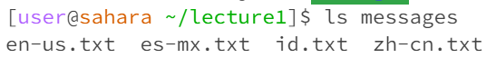

## cd No Argument:

WD -> /home/lecture1

Explanation -> cd stands for change directory. When no argument is given, it defaults to changing directory to the parent directory

Error? -> No

## cd Directory Argument:

WD -> /home/lecture1

Explanation -> cd stands for change directory. When a directory argument is given, working directory changes into the argument given

Error? -> No

## cd File Argument:

WD -> /home/lecture1

Explanation ->  cd stands for change directory. When a file argument is given, an error is outputted because a file is not considered a directory

Error? -> Yes

## ls No Argument:

WD -> /home/lecture1

Explanation -> ls lists all of the options in the given directory. The output is the options in the lecture1 directory because this is the default output with no argument given.

Error? -> No

## ls Directory Argument:

WD -> /home/lecture1

Explanation -> ls lists all of the options in the given directory. The output is the options in the messages directory because the argument given is messages

Error? -> No

## ls File Argument:

WD -> /home/lecture1

Explanation -> ls lists all of the options in the given directory. The only output is Hello.Java because a file has no other possible options to choose from.

Error? -> No

## cat No Argument:

WD -> /home/lecture1

Explanation -> cat concantenates the content from the files given as an argument. This does not output an error but terminal waits until either a valid file name is given or Ctrl + C is 
inputted.

Error? -> No

## cat Directory Argument:

WD -> /home/lecture1

Explanation -> cat concantenates the content from the files given as an argument. This outputs an error as a directory does not have any content to print.

Error? -> yes

## cat File Argument:

WD -> /home/lecture1

Explanation -> cat concantenates the content from the files given as an argument. The output is the content of messages/en-us.txt as that was the argument given.

Error? -> No
