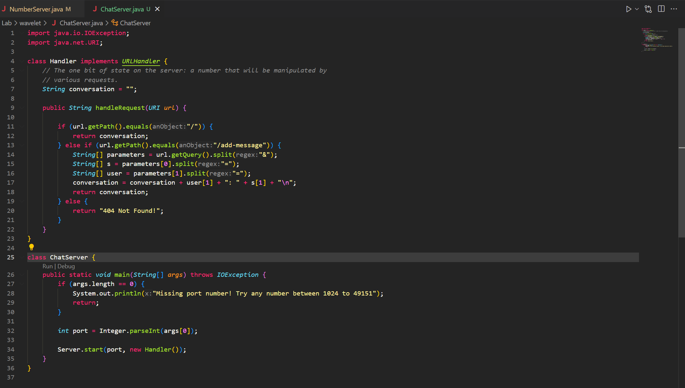
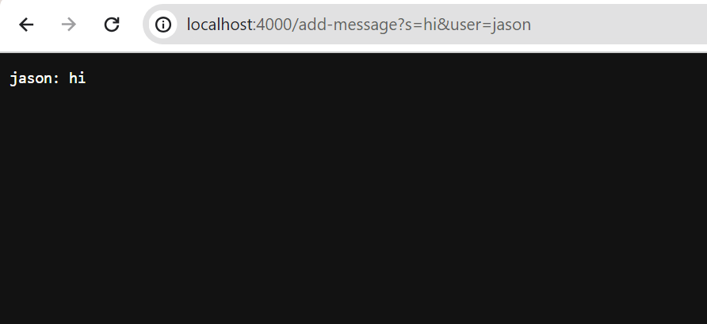
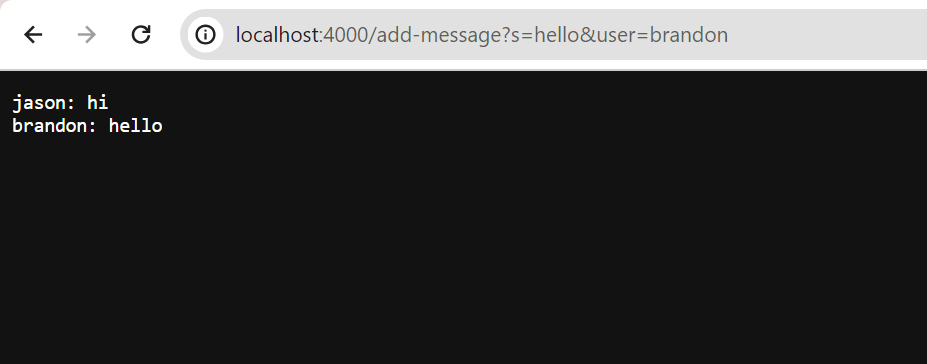
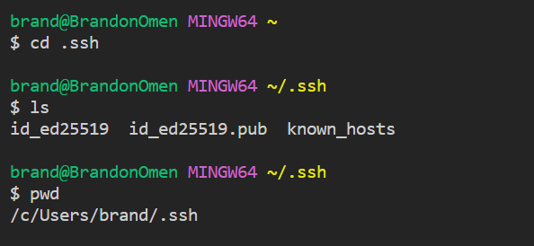
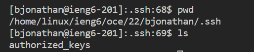
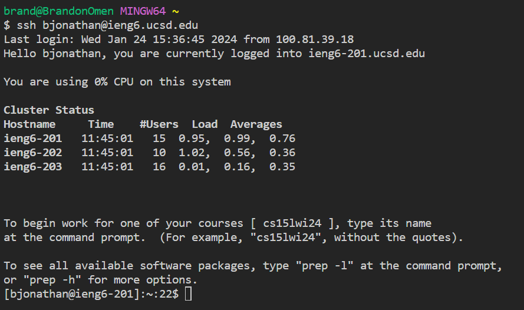

## ChatServer Code:


## First /add-message:



## Second /add-message:


## Absolute Path to Private Key


Absolute Path: 
```
/c/Users/brand/.ssh/id_ed25519.pub
```
## Absolute Path to Public Key


Absolute Path: 
```
/home/linux/ieng6/oce/22/bjonathan/.ssh/authorized_keys
```
## Login with no Password


## New Things I Learnt in Week 2 & 3
I learnt how new commands such as ssh which allows for me to connect to the university's computer remotely to execute commands from my own laptop. I also learnt how a basic server with query works because of how the program reads a URL.
