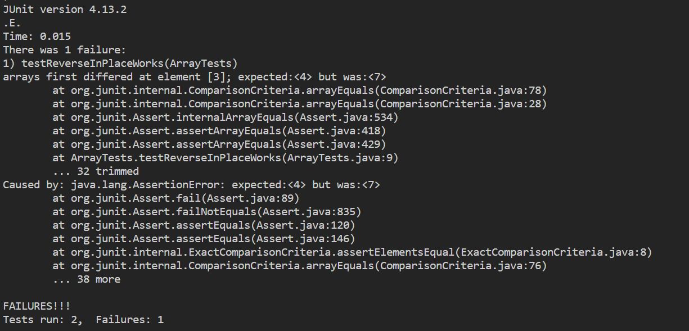

# Part 1

## Failure Inducing Test
```
  @Test
  public void testReverseInPlaceWorks() {
    int[] input1 = { 3, 4, 5, 7, 6 };
    ArrayExamples.reverseInPlace(input1);
    assertArrayEquals(new int[] { 6, 7, 5, 4, 3 }, input1);
  }
```

## No Failure Induced Test
```
 @Test
  public void testReverseInPlaceFailure() {
    int[] input1 = { 3 };
    ArrayExamples.reverseInPlace(input1);
    assertArrayEquals(new int[] { 3 }, input1);
  }
```

## Symptom


## The Bug (Before vs After)

Before:
```
static void reverseInPlace(int[] arr) {
  for (int i = 0; i < arr.length; i += 1) {
    arr[i] = arr[arr.length - i - 1];
  }
}
```

After:
```
static void reverseInPlace(int[] arr) {
  for (int i = 0; i < arr.length / 2; i += 1) {
    int temp = arr[i];
    arr[i] = arr[arr.length - i - 1];
    arr[arr.length - i - 1] = temp;
  }
}
```

Explanation:

The reason why the code before did not work is because it attempted to reverse the list by looping through the entire array. This doesnt work because after the halfway point, the array would be replacing the data at the index with itself because the data in the first half of the list was already replaced.


# Part 2 (grep options)

(All options below were found using grep --help in the terminal)

## grep -r

First Example:

```
$ grep -r "base pair" plos
plos/journal.pbio.0020190.txt:        sequence, which is a specific series of eight base pairs in the DNA of the bacterial
plos/journal.pbio.0020190.txt:        chromosomes, on the order of one or two thousand base pairs of DNA (or less—their length is
plos/journal.pbio.0020223.txt:        Watson-Crick base pairing, the proximity of the synthetic reactive groups elevates their
```
This command recursively finds all instances where the pattern "base pair" happens in all files in plos and its directories. Useful because it can quickly sort through files with/without the pattern which would allow user to find files about a topic easily.

Second Example:

```
$ grep -r "emission spectroscopy" biomed
biomed/1471-2091-3-4.txt:          with atomic emission spectroscopy detection (ICP-AES) was
biomed/1471-2091-3-4.txt:        AES, atomic emission spectroscopy; bp, base pairs; CD,
```

This command recursively finds all instances where the pattern "emission spectroscopy" happens in all files in biomed and its directories. Similarly useful because it can quickly sort through files with/without the pattern which would allow user to find files about a topic easily.

## grep -l

First Example:

```
$ grep -l "base pair" plos/*.txt
plos/journal.pbio.0020190.txt
plos/journal.pbio.0020223.txt
```

This command returns all text files in plos which contains the pattern "base pair". Useful because it allows user to quickly find all files with a specific context that they are looking for.

Second Example:

```
$ grep -l  "emission spectroscopy" biomed/*.txt
biomed/1471-2091-3-4.txt
```

This command returns all text files in biomed which contains the pattern "emission spectroscopy". Similarly useful because it allows user to quickly find all files with a specific context that they are looking for.

## grep -m --max-count=NUM

First Example:

```
$ grep -m 7 "base" plos/journal.pbio.0030065.txt
        Biological databases offer access to formalized facts about many aspects of
        organisms, and so on. These databases are becoming increasingly important to researchers.
        The information that populates databases is generated by research teams and is usually
        deposit data into a database but, more often, it is extracted from the published literature
        and deposited into the databases by human curators, a painstaking process.
        Research literature and scientific databases fulfil different needs. Literature provides
        use in databases. By contrast, databases efficiently provide large quantities of data and
```

This command returns the first 7 lines that the word "base" appears in the plos/journal.pbio.0030065.txt file. Useful because it allows user to sort through the first few times a pattern appears instead of seeing every single instance of the pattern.

Second Examples:

```
$  grep -m 1 "PLANES" 911report/chapter-1.txt
"WE HAVE SOME PLANES"
```

This command returns the first line that the word "PLANES" appears in the 911report/chapter-1.txt file. In this context, allows user to see the very first line a word appears in a file

## grep -C --context=NUM

First Example:

```
$  grep -m 1 -C 3 "PLANES" 911report/chapter-1.txt


"WE HAVE SOME PLANES"

    Tuesday, September 11, 2001, dawned temperate and nearly cloudless in the eastern United States. Millions of men and women readied themselves for work. Some made their way to the Twin Towers, the signature structures of the World Trade Center complex in New York City. Others went to Arlington, Virginia, to the Pentagon. Across the Potomac River, the United States Congress was back in session. At the other end of Pennsylvania Avenue, people began to line up for a White House tour. In Sarasota, Florida, President George W. Bush went for an early morning run.
```
This command returns the first line where the word "PLANES" appears and also 3 lines of context before and after that line appears. Useful because it allows users to have a better idea of when/where a pattern appears in the file.

Second Example:

```
$  grep -m 1 -r "emission spectroscopy"  -C 3 biomed
biomed/1471-2091-3-4.txt-          analyses, the protein samples were dialyzed versus 3 × 1
biomed/1471-2091-3-4.txt-          L of metal-free, 50 mM HEPES, pH 7.5 over 96 hours at
biomed/1471-2091-3-4.txt-          4°C. A Varian Inductively Coupled Plasma Spectrometer
biomed/1471-2091-3-4.txt:          with atomic emission spectroscopy detection (ICP-AES) was
biomed/1471-2091-3-4.txt-          used to determine metal content of multiple preparations
biomed/1471-2091-3-4.txt-          of wild type L1 and L1 mutants. Calibration curves were
biomed/1471-2091-3-4.txt-          based on three standards and had correlation coefficient

```

This command returns the first line and the file where the word "emission spectroscopy" appears and also 3 lines of context before and after that line appears. Useful because it allows users to have a better idea of when/where a pattern appears and in what file it appears in.


