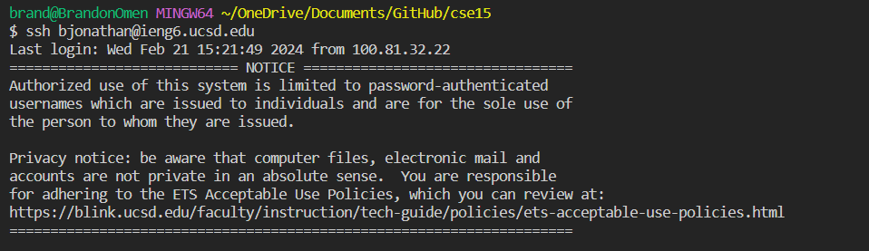
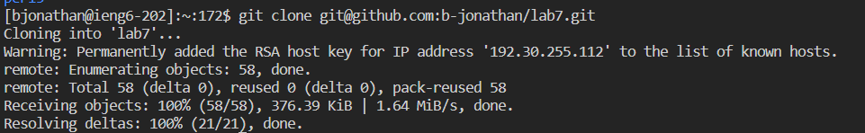
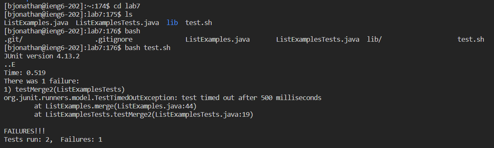
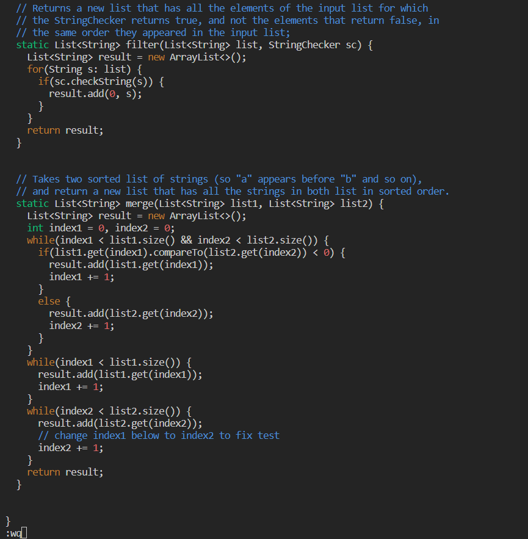
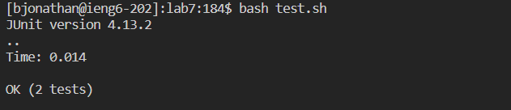
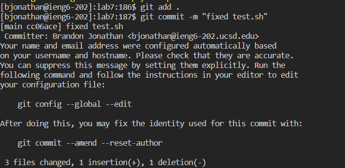

## Step 4


Keys pressed: 

```
<up> <enter>
```

The ssh bjonathan@ieng6.ucsd.edu command was the first command in the search history


## Step 5


Keys pressed: 

```
g i t <space> c l o n e <Ctrl + v> <enter>
```

Manually typed git clone and then copy pasted the github ssh URL that was forked.

## Step 6


Keys pressed: 

```
c d l <tab> <enter> l s <enter> b a s h t <tab> <enter>
```

After cloning, changed directory into lab7 (autocompleted by tab) then ls'd to find the bash script that contained the testing commands. Finally, bash and typed t (autocomplted to test.sh with tab) and ran the script

## Step 7


Keys pressed: 

```
v i m <shift + l> <tab> . j <tab> <enter> <shift + down> <up> <up> <up> e c w 2 <esc> : w q <enter>
```

Problem with test is that there is an index1 written instead of index2. First, use vim to open the ListExamples.java (autocompleted with tabs) and then navigate with <shfit + down> and <up> to reach the line with the incorrect index. Then, use e to reach the end of the word index1 then use c w 2 to change the last character from 1 -> 2. Escape to leave change mode and finally use :wq to save the changes made.

## Step 8


Keys Pressed: 

```
<up> <up> <enter>
```

bash test.sh was one command above vim ListExamples.java in the search history so only needed to go up twice and enter the command.

## Step 9


Keys Pressed:

```
g i t a d d . <enter> g i t c o m <tab> - m " f i x e d t e s t . s h " <enter>
```

Had to manually write most of the commands except for using <tab> to autocomplete commit
