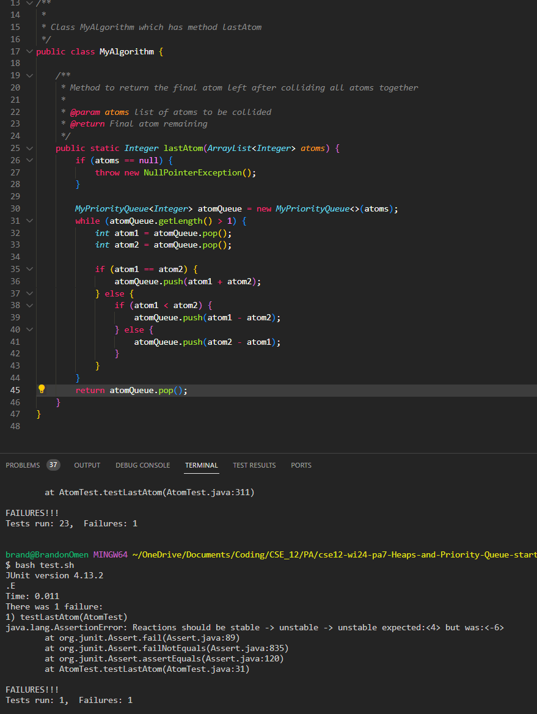
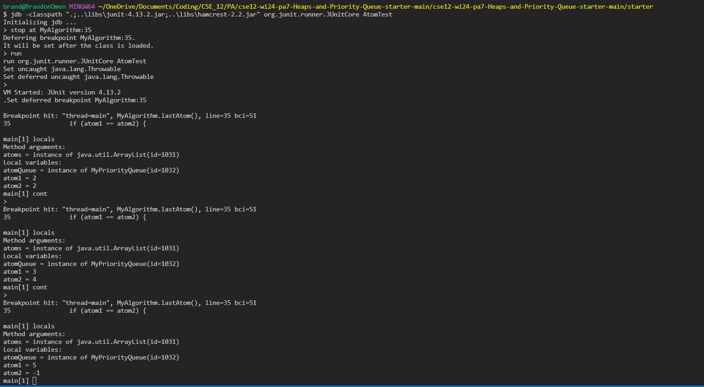

## 1. Original Post



The symptom is that the algorithm to find the last atom is showing the wrong code.
The student guesses that the problem with the algorithm lies somewhere within a wrong conditioning for the for loop in the algorithm.

## 2. Leading Question from TA

If you think something is wrong with the conditioning of the for loop, something you can try is analyzing the loop for each iteration.

How do you think you can use jdb to find the data points at a certain line for each iteration of the loop?

## 3. Debugging Things



From the test input of {2, 5, 3, 2}, it is expected that the loop will go 

atom1 = 2, atom2 = 2 then

atom1 = 3, atom2 = 4 then

atom1 = 1, atom2 = 5 then

return 6

As can be seen from the debugging picture, the first iteration and second iteration show the correct values.

However, in the last iteration atom1 = 5 and atom2 = -1.

This problem is originally caused by the if condition during the second iteration. when atom2 = 4 and atom1 = 3, the new atom pushed should be 1 but in the current program, the atom pushed is -1.

The cause of this problem is the wrong if condition in line 38 of the code. 

The correct condition should be if atom1 > atom2 instead of atom1 < atom2.


## 4. Setup Information

# File Directory

```
cse12-wi24-pa7-Heaps-and-Priority-Queue-starter-main/
|- libs/
  |- hamcrest-2.2.jar
  |- junit-4.13.2.jar
|- starter
  |- AtomTest.class
  |- AtomTest.java
  |- MyAlgorithm.class
  |- MyAlgorithm.java
  |- MyMinHeap.class
  |- MyMinHeap.java
  |- MyPriorityQueue.class
  |- MyPriorityQueue.java
  |- test.sh

```

# File Content with Bug

(There are files such as MyMinHeap.java and MyPriorityQueue.java which are treated more as imports and hence I will not be posting their content)

MyAlgorithm.java:

```
import java.util.ArrayList;

/**
 * 
 * Class MyAlgorithm which has method lastAtom
 */
public class MyAlgorithm {

    /**
     * Method to return the final atom left after colliding all atoms together
     * 
     * @param atoms list of atoms to be collided
     * @return Final atom remaining
     */
    public static Integer lastAtom(ArrayList<Integer> atoms) {
        if (atoms == null) {
            throw new NullPointerException();
        }

        MyPriorityQueue<Integer> atomQueue = new MyPriorityQueue<>(atoms);
        while (atomQueue.getLength() > 1) {
            int atom1 = atomQueue.pop();
            int atom2 = atomQueue.pop();

            if (atom1 == atom2) {
                atomQueue.push(atom1 + atom2);
            } else {
                if (atom1 < atom2) {
                    atomQueue.push(atom1 - atom2);
                } else {
                    atomQueue.push(atom2 - atom1);
                }
            }
        }
        return atomQueue.pop();
    }
}
```

AtomTest.java:
```
import org.junit.Test;

import java.util.ArrayList;
import java.util.Arrays;
import java.util.List;

import static org.junit.Assert.assertEquals;
import static org.junit.Assert.assertNotNull;

/**
 * This class contains part of the public test cases for MyMinHeap
 * and MyPriorityQueue
 */
public class AtomTest {
    // ===================== MyAlgorithm Public Tests =====================
    // Note: This test assumes your Priority Queue works correctly

    /**
     * Tests the lastAtom function
     */
    @Test
    public void testLastAtom() {

        ArrayList<Integer> atoms = new ArrayList<>(Arrays.asList(2, 5, 3, 2));
        assertEquals("Reactions should be stable -> unstable -> unstable",
                Integer.valueOf(4), MyAlgorithm.lastAtom(atoms));

    }
}
```

test.sh:
```
set -e

javac -g -cp ".;..\libs\junit-4.13.2.jar;..\libs\hamcrest-2.2.jar" AtomTest.java
java  -cp ".;..\libs\junit-4.13.2.jar;..\libs\hamcrest-2.2.jar" org.junit.runner.JUnitCore AtomTest
```

# Command Lines to Make Bug
```
jdb -classpath ".;..\libs\junit-4.13.2.jar;..\libs\hamcrest-2.2.jar" org.junit.runner.JUnitCore AtomTest
> stop at MyAlgorithm:35
> run
main[1] cont
main[1] cont
main[1] cont
```

# Description What to Edit to Fix Bug

In MyAlgorithm.java line 38:

```
if (atom1 < atom2):
```

should be changed to 

```
if (atom1 > atom2):
```


## Part 2

There were a lot more things that I first encountered in the second half of CSE 15L compared to the first half. Dealing with bash, jdb, exec(), ls, less etc. were all things I dealt with for the first time in CSE 15L.

One of the things that I've always wanted to utilize when coding was using a debugger. However, I wasn't able to learn it properly myself. Learning the technicalities on what you can and cannot do after being given the first step
of actually downloading the debugger opened my eyes to the possibilites. While this lab report is a hypothetical application of JDB on my CSE 12 PAs, I actually used jdb to solve a bug I had when dealing with BSTs in CSE 12.

